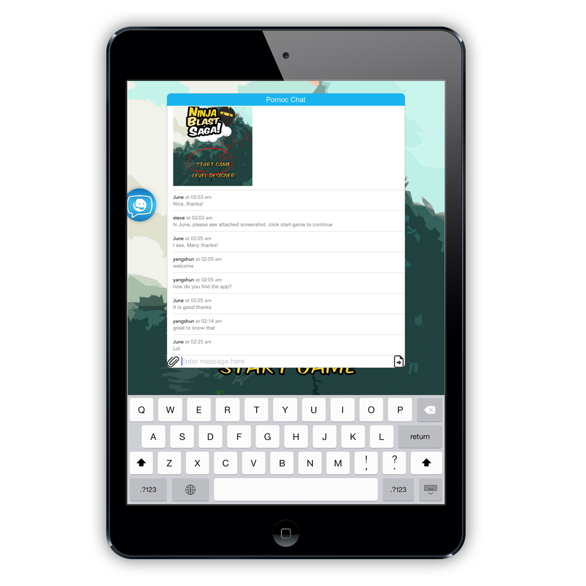
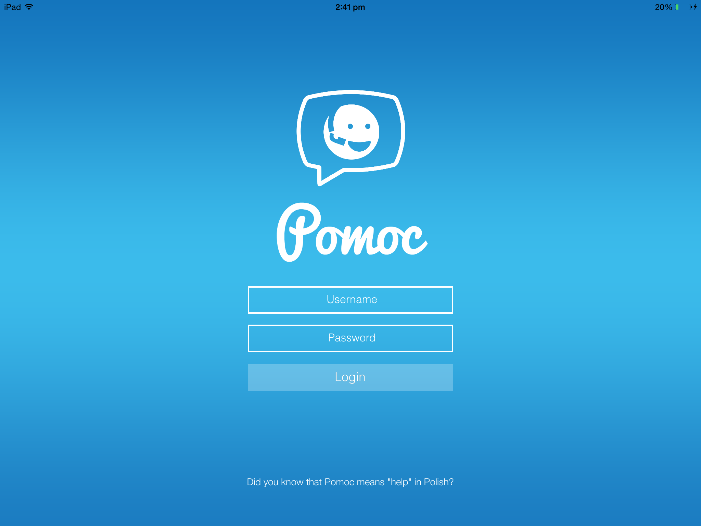
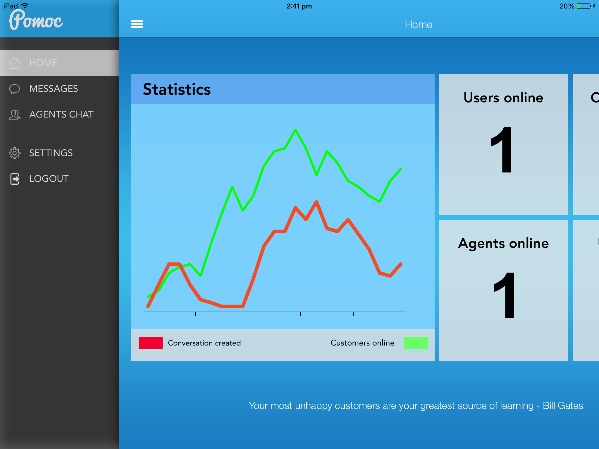
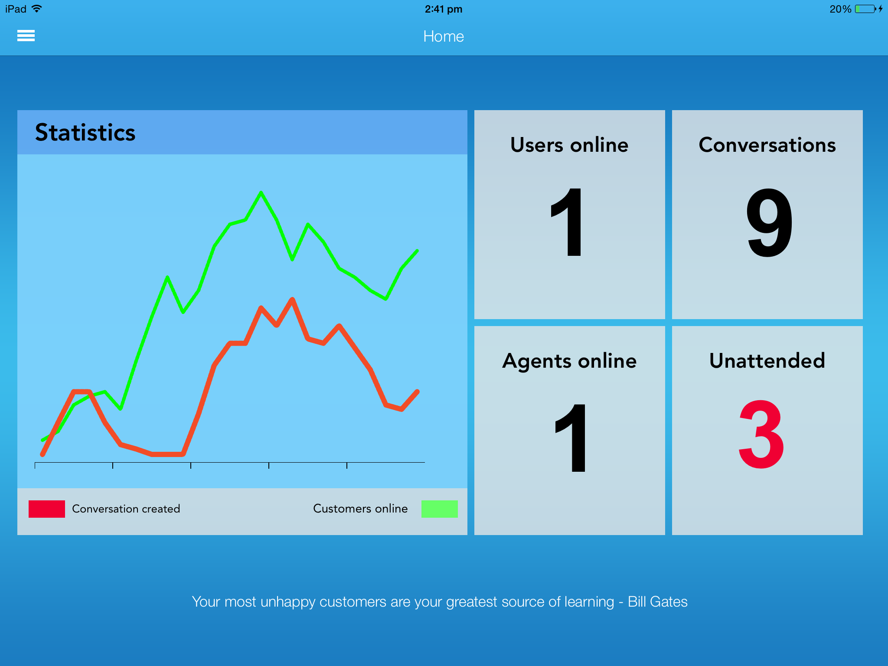
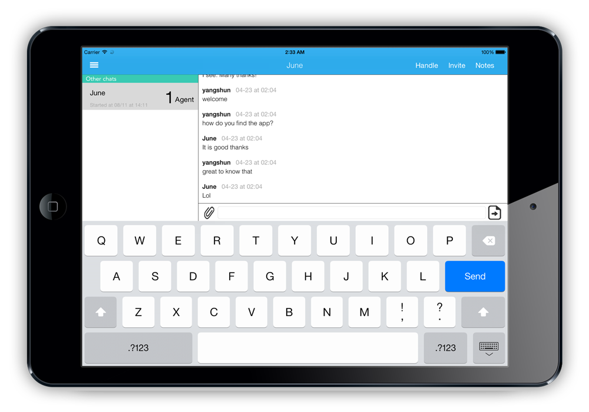
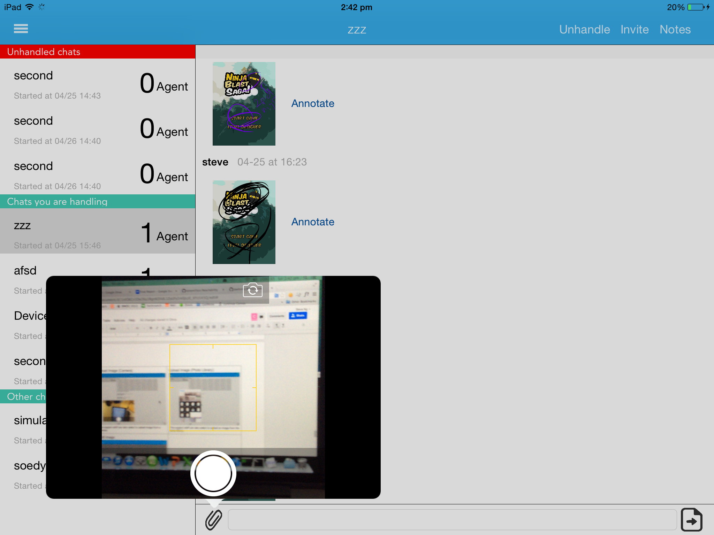
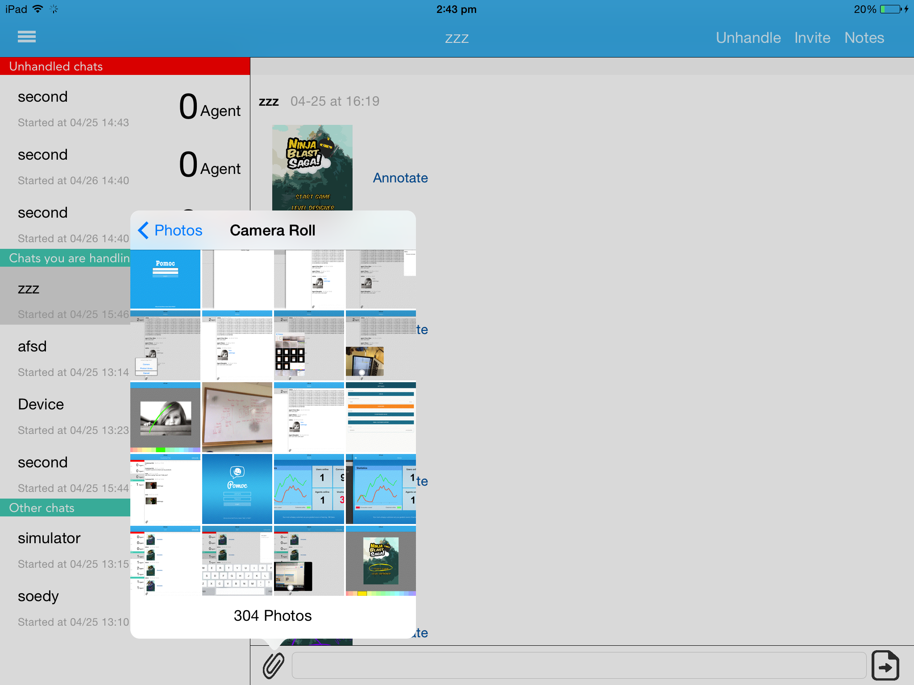
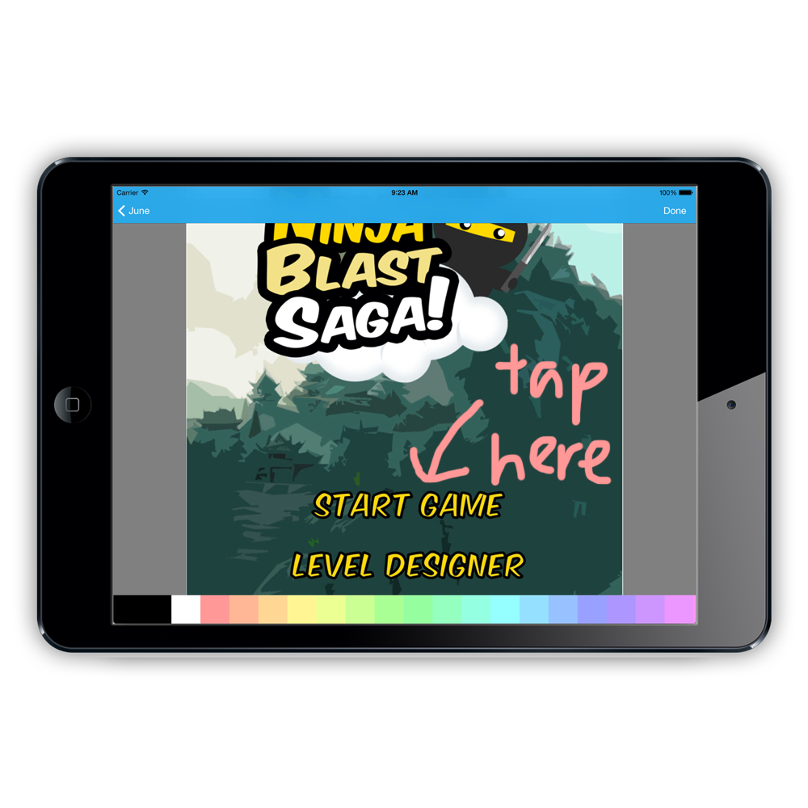

Pomoc
===

### Introduction

Pomoc is a B2B service that allows vendors to easily create a communication channel with users of their mobile apps via live chat for the purpose of customer support and service. After vendors install the Pomoc SDK (Standard Developer’s Kit) into their existing mobile applications, users of their mobile apps will able to talk to vendors directly from the app.

### Repository Structure

- **Backend**: Backend server
- **Dashboard**: Dashboard client
- **Framework**: Pomoc Framework

### Glossary of Terms

- **Vendors** - Pomoc’s direct users, the businesses who integrate the Pomoc widget into their mobile applications.
- **Customer** - The users of the vendors’ applications. They use the Pomoc widget to chat with the vendors’ support team.
- **Pomoc iOS SDK** - Allow vendors to add and customize the Pomoc widget into their mobile applications. 
- **Pomoc Dashboard Client** - An iPad app that vendors’ agents use to respond to their customer queries. 
- **Agent** - The customer service representatives from the vendors. They use the Pomoc dashboard client to chat with the customers.

### SDK Demo

### Dashboard App

